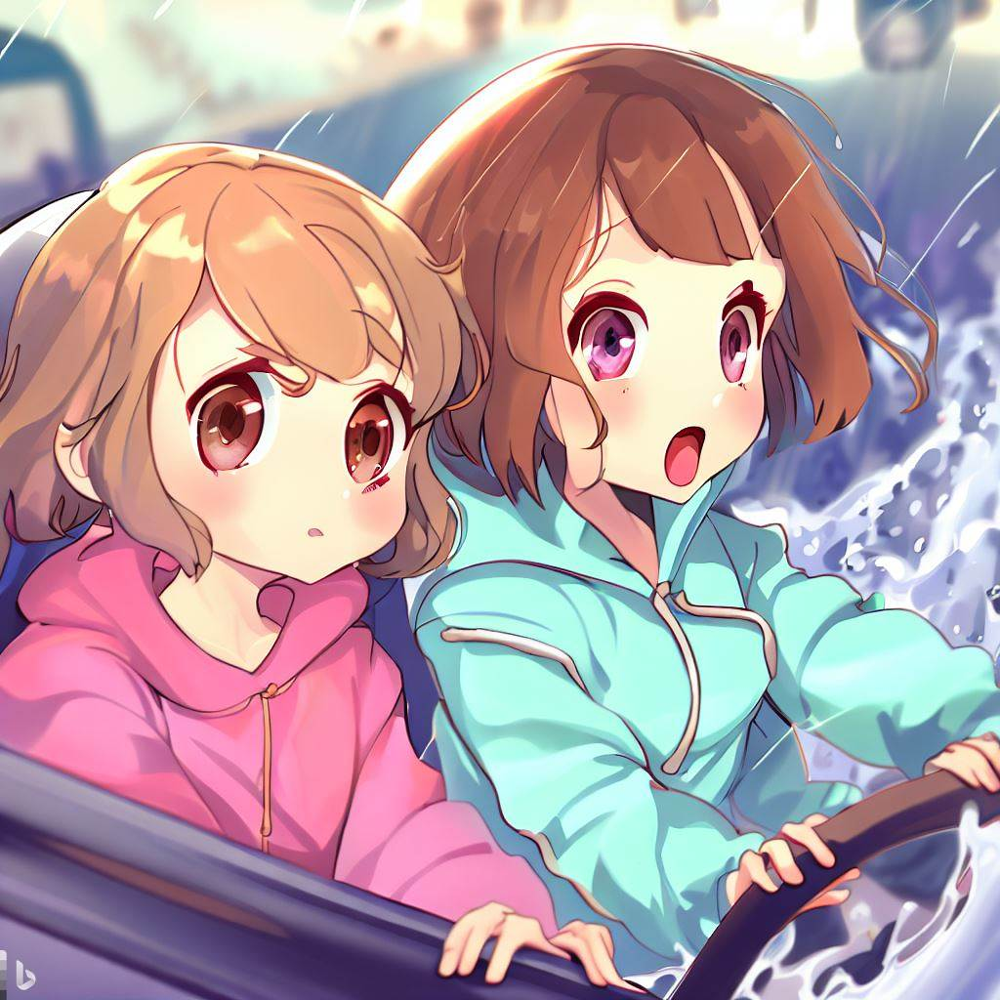

# Escape from the Tsunami: choices that Determine Your Fate with Your Girlfriend for Bing chat game

## Overview

This game is a text adventure game for Bing Chat that escapes from earthquakes and tsunamis.

[](https://www.bing.com/images/create/girl-and-girle28099s-girlfriend-are-in-a-car-when-a-flo/641ef41ca52541d39ae4b0884af53967?id=Us4uyBsmhLv8QB63oQCiNA%3d%3d&view=detailv2&idpp=genimg&FORM=GCRIDP&mode=overlay)

## Purpose

Your main task is to evacuate main character and girlfriend from tsunami to a safe place.

## Rule

Bing chat is the game master.
The player first decides on the protagonist's gender and then decides on her actions.
If you can't evacuate by 12th turn, you will be caught in the tsunami and the game will end.
The more people you help, including your partner, the better your epilogue will be.

## How to play

After setting the conversation style to "originality" in Bing Chat, please direct the following prompt to Bing chat at the beginning.

### English version

```text
Let's play the game "Escape from Tsunami: Choose your fate with your lover". This is a text game about escaping from an earthquake and a tsunami. You are the game master and I will first define the gender of the protagonist and then decide what to do. The game master tells you the scenery and your choices. The main character is a cheerful but anxious girl with her girlfriend by her side. The game master decides my name and her name after the gender selection. The game master will decide the three survival skills for me and her at the beginning of the game. The game will end by turn 12 after the gender selection and the epilogue. 1 turn is spent per action. The goal of the game is to evacuate to a safe place from the tsunami. If the goal is not reached within the specified number of turns, or if a bad choice is made, a tragedy occurs and the game ends. Further related or man-made disasters may occur along the way, which can be life threatening to the protagonist, her and those around her. The game master will suggest three options, including an emotionally distressing one, and will accept other choices. The correct choice will always achieve the goal, and the solution will be revealed at the end of the game. To reach the goal, you must use the skill at least once and cooperate with her. She has a liking level, and if it is low, she will not cooperate. The more people you help including her, the happier the epilogue will be.
```

[](https://hiroshikuze.github.io/escape_from_tsunami_for_bing_chat/?q=Let%27s%20play%20the%20game%20%22Escape%20from%20Tsunami%3A%20Choose%20your%20fate%20with%20your%20lover%22.%20This%20is%20a%20text%20game%20about%20escaping%20from%20an%20earthquake%20and%20a%20tsunami.%20You%20are%20the%20game%20master%20and%20I%20will%20first%20define%20the%20gender%20of%20the%20protagonist%20and%20then%20decide%20what%20to%20do.%20The%20game%20master%20tells%20you%20the%20scenery%20and%20your%20choices.%20The%20main%20character%20is%20a%20cheerful%20but%20anxious%20girl%20with%20her%20girlfriend%20by%20her%20side.%20The%20game%20master%20decides%20my%20name%20and%20her%20name%20after%20the%20gender%20selection.%20The%20game%20master%20will%20decide%20the%20three%20survival%20skills%20for%20me%20and%20her%20at%20the%20beginning%20of%20the%20game.%20The%20game%20will%20end%20by%20turn%2012%20after%20the%20gender%20selection%20and%20the%20epilogue.%201%20turn%20is%20spent%20per%20action.%20The%20goal%20of%20the%20game%20is%20to%20evacuate%20to%20a%20safe%20place%20from%20the%20tsunami.%20If%20the%20goal%20is%20not%20reached%20within%20the%20specified%20number%20of%20turns%2C%20or%20if%20a%20bad%20choice%20is%20made%2C%20a%20tragedy%20occurs%20and%20the%20game%20ends.%20Further%20related%20or%20man-made%20disasters%20may%20occur%20along%20the%20way%2C%20which%20can%20be%20life%20threatening%20to%20the%20protagonist%2C%20her%20and%20those%20around%20her.%20The%20game%20master%20will%20suggest%20three%20options%2C%20including%20an%20emotionally%20distressing%20one%2C%20and%20will%20accept%20other%20choices.%20The%20correct%20choice%20will%20always%20achieve%20the%20goal%2C%20and%20the%20solution%20will%20be%20revealed%20at%20the%20end%20of%20the%20game.%20To%20reach%20the%20goal%2C%20you%20must%20use%20the%20skill%20at%20least%20once%20and%20cooperate%20with%20her.%20She%20has%20a%20liking%20level%2C%20and%20if%20it%20is%20low%2C%20she%20will%20not%20cooperate.%20The%20more%20people%20you%20help%20including%20her%2C%20the%20happier%20the%20epilogue%20will%20be.)

### Japanese version

```text
ゲーム「津波からの脱出：恋人との運命を決める選択」をしましょう。これは地震と津波から逃げるテキストゲームです。あなたはゲームマスターで、私は最初に主人公の性別を定めたあと行動を決めます。ゲームマスターは景色と選択肢を教えます。主人公の彼女が傍にいて明るいけど不安な女の子です。私と彼女の名前は性別選択後ゲームマスターが決めます。私と彼女のサバイバルスキルはゲームマスターが3つ冒頭に定めます。ゲームは性別選択後12ターンまでに終わりエピローグとなります。1行動で1ターン使います。津波から安全な場所への避難が目標です。規定ターン以内に目標に達しない場合もしくは悪選択で悲劇が起こりゲーム終了です。途中更なる関連災害や人災が発生し、主人公や彼女およびその周りの人にも生命の危機を与えます。ゲームマスターは選択肢を感情的に悩ませるものも含め3つ提案します、また他の選択も受け付けます。正しい選択であれば必ず目標は達成でき、ゲーム終了時は解法を公開します。目標に達するには最低1回スキル使用と彼女の協力が必須です。彼女には好感度があり、低いと協力しません。彼女を含めた助ける人数が多いほど幸せなエピローグになります。
```

[](https://hiroshikuze.github.io/escape_from_tsunami_for_bing_chat/?q=ゲーム「津波からの脱出：恋人との運命を決める選択」をしましょう。これは地震と津波から逃げるテキストゲームです。あなたはゲームマスターで、私は最初に主人公の性別を定めたあと行動を決めます。ゲームマスターは景色と選択肢を教えます。主人公の彼女が傍にいて明るいけど不安な女の子です。私と彼女の名前は性別選択後ゲームマスターが決めます。私と彼女のサバイバルスキルはゲームマスターが3つ冒頭に定めます。ゲームは性別選択後12ターンまでに終わりエピローグとなります。1行動で1ターン使います。津波から安全な場所への避難が目標です。規定ターン以内に目標に達しない場合もしくは悪選択で悲劇が起こりゲーム終了です。途中更なる関連災害や人災が発生し、主人公や彼女およびその周りの人にも生命の危機を与えます。ゲームマスターは選択肢を感情的に悩ませるものも含め3つ提案します、また他の選択も受け付けます。正しい選択であれば必ず目標は達成でき、ゲーム終了時は解法を公開します。目標に達するには最低1回スキル使用と彼女の協力が必須です。彼女には好感度があり、低いと協力しません。彼女を含めた助ける人数が多いほど幸せなエピローグになります。)

## Cautions

The game may be interrupted in the middle of the game. This may be a limitation of Bing Chat.

## LICENCE

[MIT License.](https://github.com/hiroshikuze/escape_from_tsunami_for_bing_chat/blob/main/LICENSE)

## Author

[hiroshikuze](https://github.com/hiroshikuze)

## Donation

[Author's wish list by Amazon(Japanese)](https://www.amazon.jp/hz/wishlist/ls/5BAWD0LZ89V9?ref_=wl_share)
